# Online Bookstore System
The Book Republic Online Bookstore System is a web application developed using HTML, CSS, JavaScript, PHP, and MySQL.

 

## Features
### All Users
* Login authentication

### Admin
* Manage user account
* Manage supplier
* Manage stock purchase
* Manage product
* Manage customer order
* Manage customer contact
* Manage book rating
* Generate weekly, monthly & yearly report

### Customer
* Password reset
* Customer contact
* Categorized book catalogs
* Book rating
* Shopping cart
* Order status & action
* Generate order receipt

 

## Screenshots
### Admin
#### Login
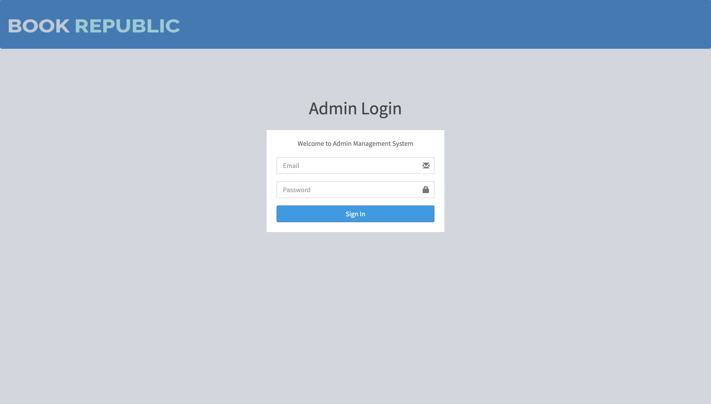

#### Dashboard
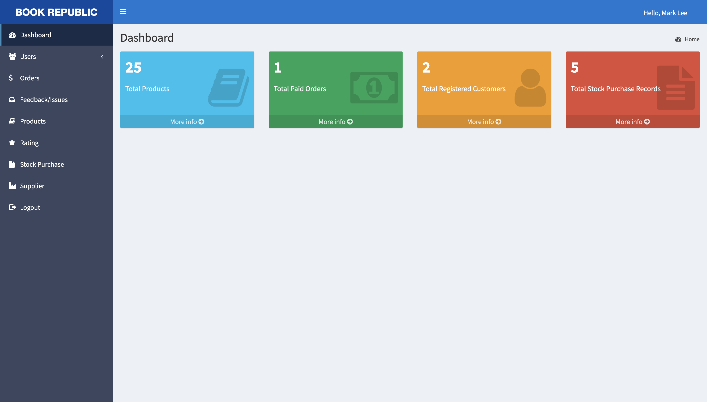

#### Manage Organization Member Account
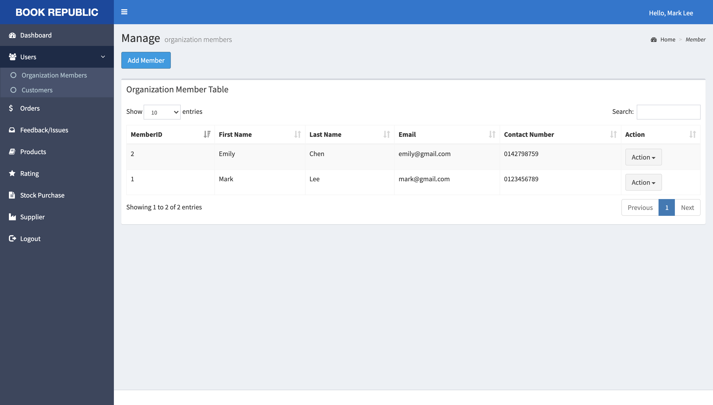

#### Manage Product
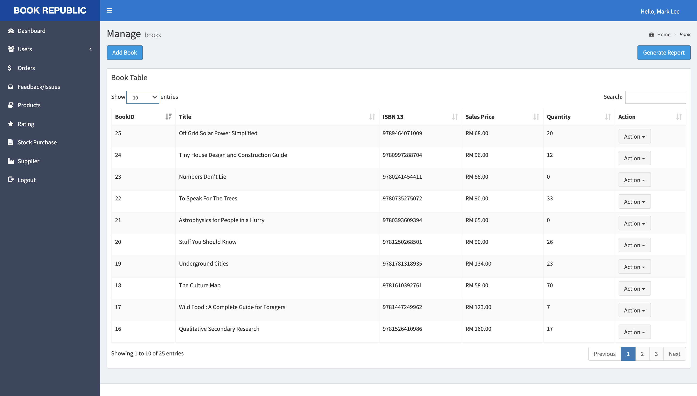

#### Manage Customer Order
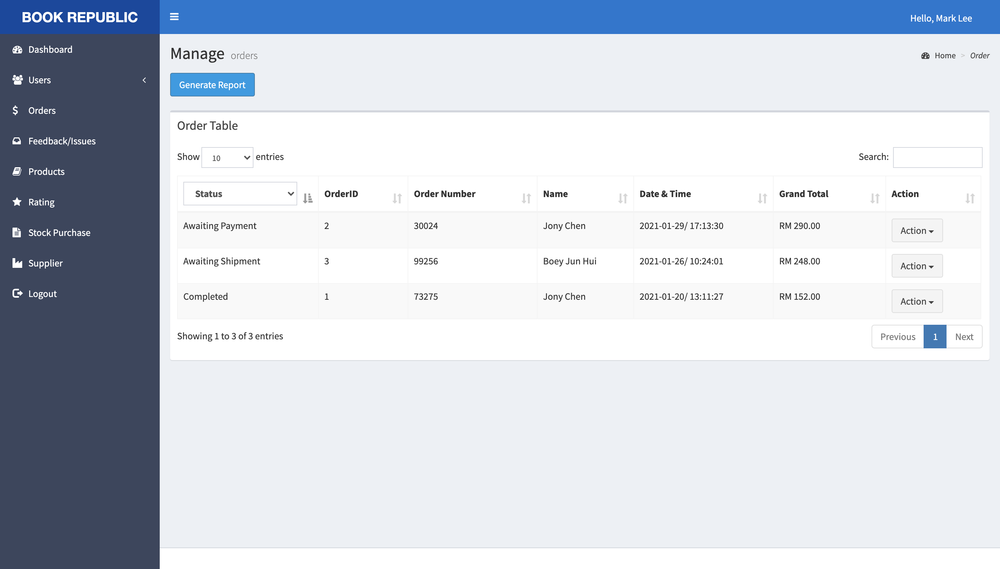
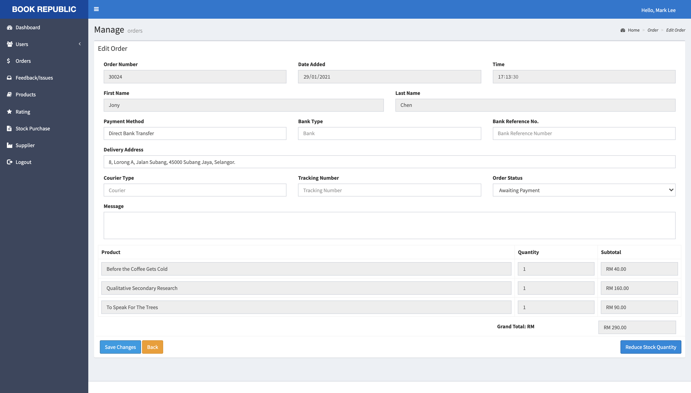

#### Report
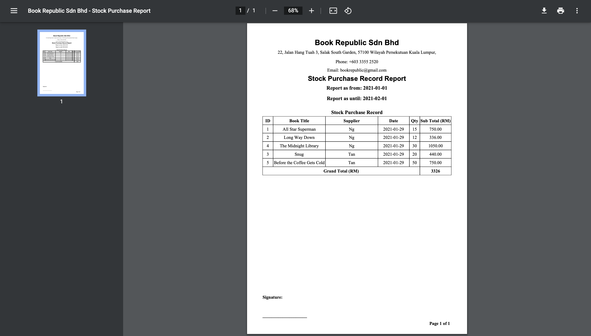

 

### Customer
#### Sign Up

#### Homepage
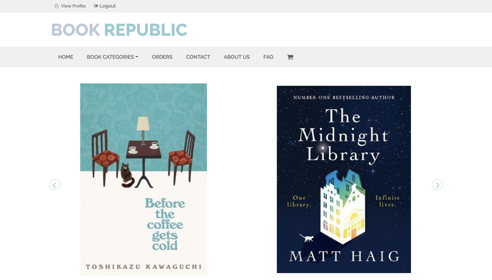

#### Book Catalog
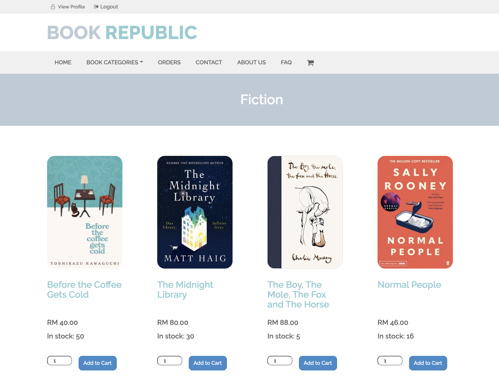
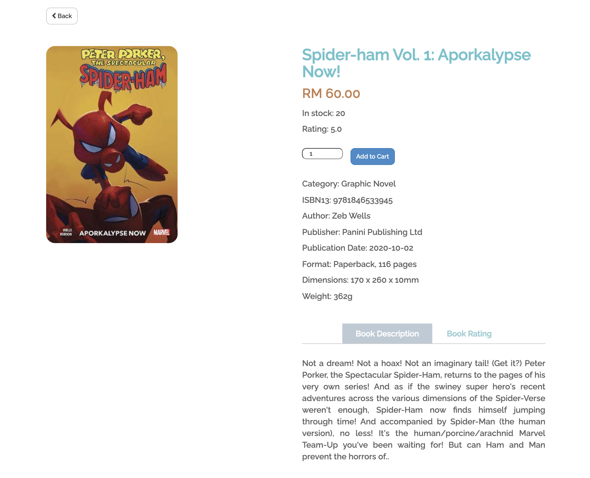

#### Shopping Cart
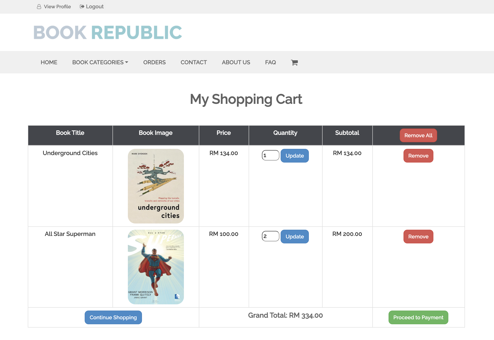

#### Orders
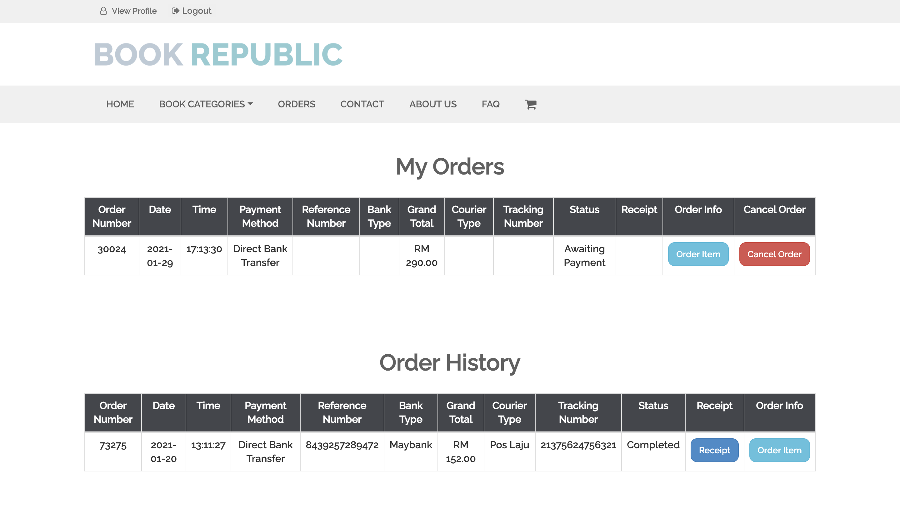

#### FAQ
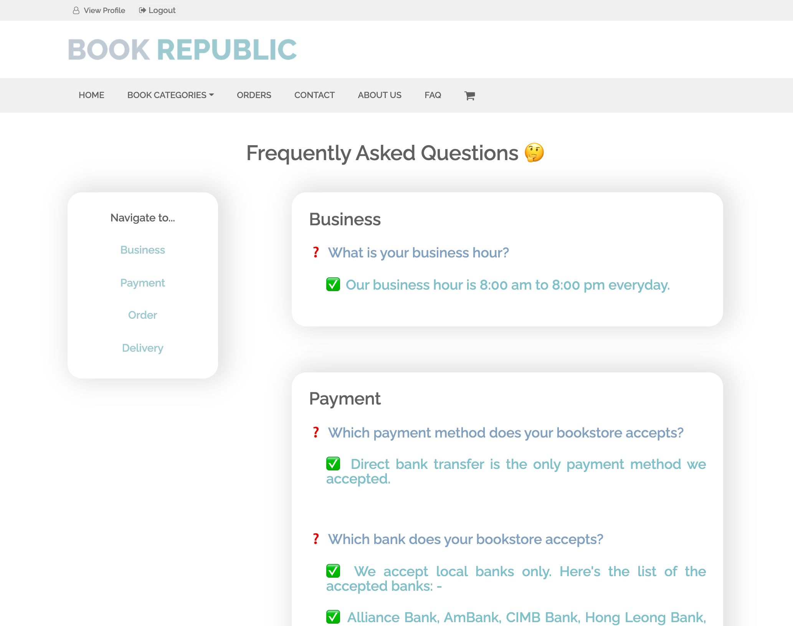

#### Order Receipt
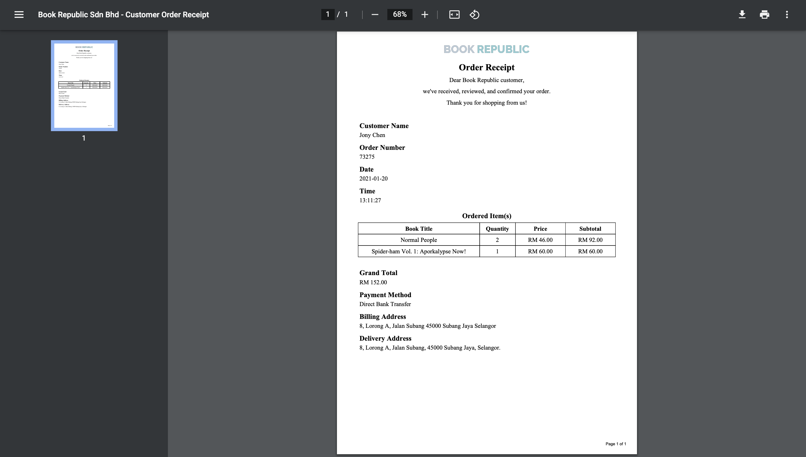
